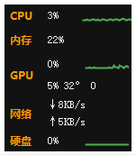
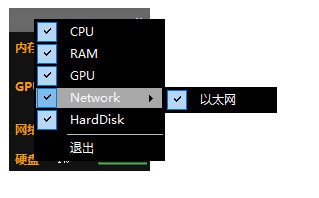

# PC资源监视器  Computer Monitor
实时监视PC运行时的状态，如：

- CPU的占用率、温度
- GPU的占用率、温度
- 硬盘的读写速度
- 网络速度
- 内存的占用率

# 界面 UI

通过无框面板的方式置顶显示

可自定义面板内容

# TODO

1. ~~实现无边框、置顶、不显示在任务栏~~
3. ~~可任意拖动面板，并记录面板相对位置（针对各种分辨率，多屏幕情况仍然能正常显示）~~
4. ~~右击菜单~~
   - ~~配置可显示内容~~
   - ~~最小化~~
   - ~~关闭~~
   - 自动启动
5. ~~可最小化到托盘，托盘图标可显示信息~~

