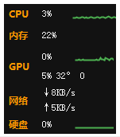
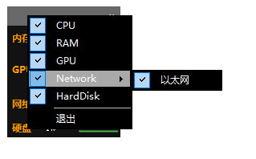
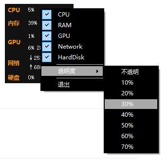

# PC资源监视器  Computer Monitor
实时监视PC运行时的状态，如：

- CPU的占用率、温度
- GPU的占用率、温度
- 硬盘的读写速度
- 网络速度
- 内存的占用率

# 界面 UI

通过无框面板的方式置顶显示

可自定义面板内容

# 功能模块

## 透明度设置

右击菜单中增加透明度滑块，滑动可以改变UI透明度

不支持全透明

在滑动过程中，支持实时查看效果

窗体激活状态时，透明度强制为0（不透明）

窗口非激活状态时，按照配置的透明度进行显示

# 升级记录

20251212：升级透明度设置功能

# TODO

1. ~~实现无边框、置顶、不显示在任务栏~~
2. ~~可任意拖动面板，并记录面板相对位置（针对各种分辨率，多屏幕情况仍然能正常显示）~~
3. ~~右击菜单~~
   - ~~配置可显示内容~~
   - ~~最小化~~
   - ~~关闭~~
   - 自动启动
4. ~~可最小化到托盘，托盘图标可显示信息~~
5. 增加透明度设置

